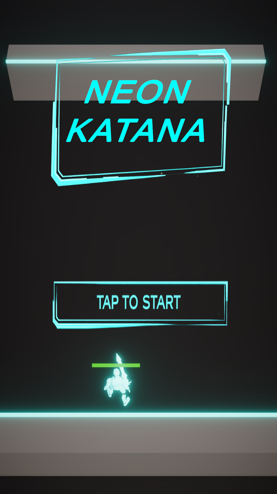
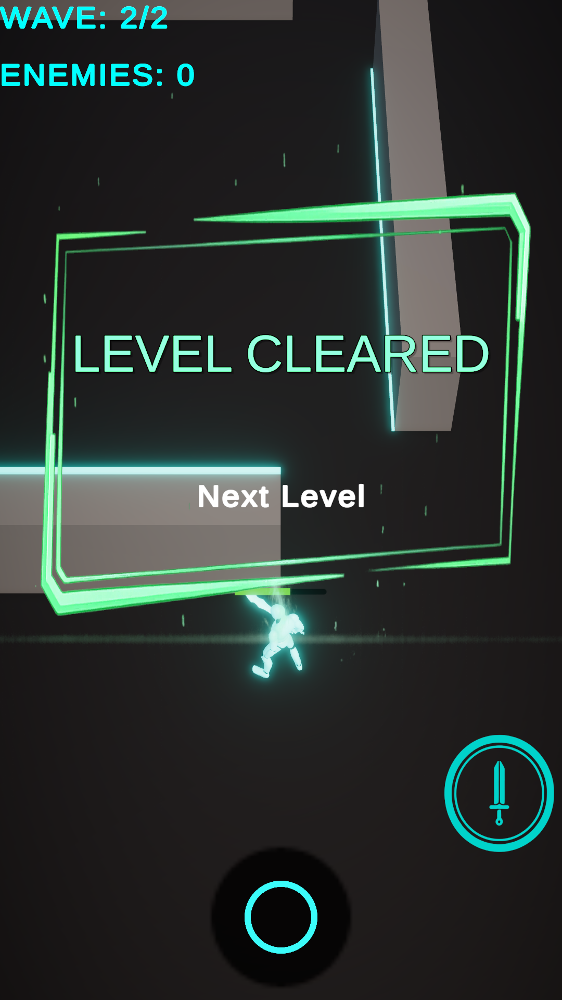

# Neon Katana

Neon Katana is a top-down action prototype built in Unity, focused on modular combat architecture and wave-based progression.

## Key highlights:

- State-driven dash combat system (Plan → Dash)
- Modular enemy AI (State Pattern + Strategy Pattern)
- Event-driven wave progression (decoupled UI & gameplay)
- Object pooling for performance
- Optimized dash hit detection (NonAlloc physics + hit buffering)

## 🎮 Gameplay Overview

- Player moves using a joystick.
- Combat is based on a **plan → execute dash** mechanic.
- Enemies spawn in structured waves.
- Clearing all waves completes the level.

---
## Screenshots

  
  
   

## Gameplay Video
[neonkatana_demo.mp4](Readme_data/Videos/neonkatana_demo.mp4)
---
## 🧠 Architecture Overview

### 🔹 Game Flow (Event-Driven)

- `GameFlowController` manages Start / Win / Lose states and pause logic.
- `LevelManager` owns wave progression and the enemy counter (single source of truth).
- `WaveManager` handles enemy spawning via object pooling.
- `GameEvents` decouples UI, VFX, and gameplay systems.

### ⚔ Combat System (State Pattern)

Combat is implemented using a State Machine:

- `PlanState`  
  Collects dash nodes and previews the path using a LineRenderer.

- `DashState`  
  Executes multi-segment dash movement using DOTween sequences.  
  Performs hit detection using `Physics.OverlapSphereNonAlloc` and prevents double hits via a hash set.

- `CombatBlackboard`  
  Shares contextual data (transform, rigidbody, stats, dash points) between states.

This allows the dash mechanic to remain modular and extendable.

--- 

### 👾 Enemy AI (State + Strategy + Blackboard)

Enemy behavior is fully modular:

- `EnemyStateMachine` with:
  - Chase
  - Anticipation
  - Attack
  - Recovery

- `EnemyBlackboard` holds shared references (target, stats, motor, attack behavior).

- Movement and attack are abstracted via interfaces:
  - `IMovementMotor` → `NavMeshMotor`
  - `IAttackBehaviour` → `MeleeAttackBehaviour`

This allows behaviors to be swapped without modifying core AI logic.

---

## 🛠 Tech Stack

- Unity (C#)
- DOTween
- NavMesh
- ScriptableObjects (PlayerStats, EnemyData, LevelData)

---

This project was created as a portfolio prototype
